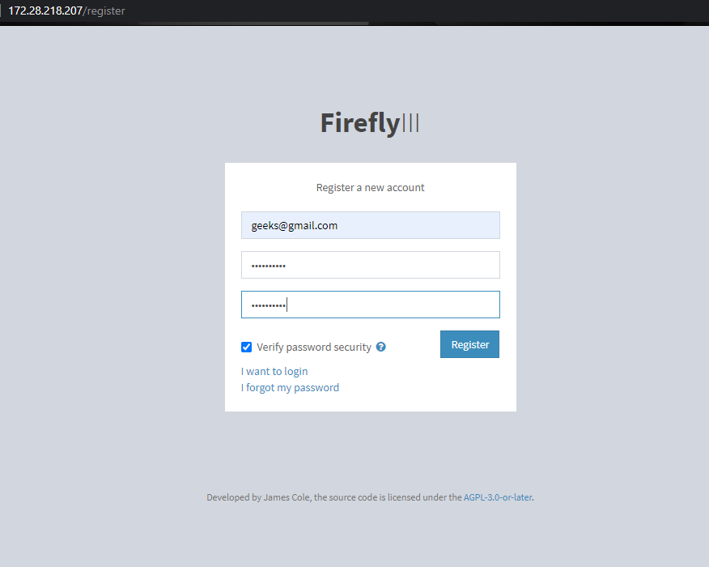
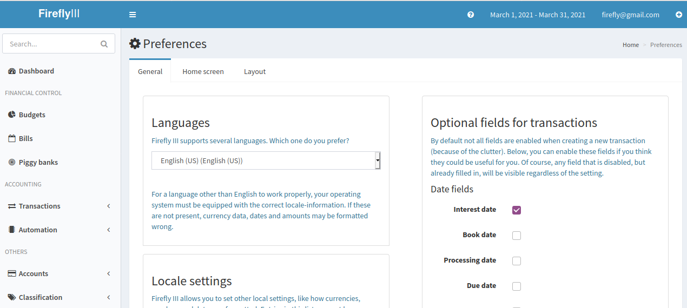

# Firefly III
<!-- PROJECT LOGO -->
<br />
<p align="center">
    
</p>

[Sekilas Tentang](#sekilas-tentang) | [Instalasi](#instalasi) | [Cara Pemakaian](#cara-pemakaian) | [Pembahasan](#pembahasan) | [Referensi](#referensi)
:---:|:---:|:---:|:---:|:---:
## Sekilas Tentang

Firefly III adalah manajer (dihosting sendiri) untuk keuangan pribadi. Firefly III termasuk ke dalam Platform open source yang berfungsi dapat membantu dalam melacak pengeluaran dan pendapatan diri sendiri, sehingga kita dapat membelanjakan lebih sedikit dan menabung lebih banyak tanpa harus mengunggah catatan keuangan mereka ke cloud.


## Instalasi
[`^ kembali ke atas ^`](#)

### Kebutuhan Sistem :
- Web Server.
- Database Server
- PHP 7.3+
- Composer

### Proses Instalasi :
#### Step 1: Update dan Upgrade Server
Pertama, buka terminal lalu lakukan update dan upgrade pada sistem. Kita juga akan memasang tool yang dibutuhkan untuk melakukan proses instalasi seperti ```Nginx```, ```PHP```, ````git````, dan juga ```vim``` sebagai text editor.

```
$ sudo apt update && sudo apt upgrade
$ sudo apt install vim git nginx curl -y
```
#### Step 2: Install Webserver dan PHP
Untuk menginstall Firefly III, kita dapat menggunakan Apache atau Nginx. Namun kali ini kita akan mencoba menggunakan webserver Nginx.

##### Install komponen php yang dibutuhkan.
    ```
    $ sudo apt install software-properties-common
    $ sudo add-apt-repository ppa:ondrej/php
    $ sudo apt update
    $ sudo apt install -y php7.3 php7.3-{cli,zip,gd,fpm,json,common,mysql,zip,mbstring,curl,xml,bcmath,imap,ldap,intl}
    ```
Kemudian cek apakah modul php telah berjalan pada server dengan perintah    
    ```
    $ sudo systemctl status php7.3-fpm
    ```
    
##### Lakukan konfigurasi pada web server. 
Pertama, lakukan backup konfigurasi default sebelum menambahkan konfigurasi baru.

```
    $ cd /etc/nginx/sites-enabled/
    $ sudo mv default{,.bak}
```
    
Kemudian Buat file konfigurasi baru bernama ``` firefly.conf ``` pada direktori ```/etc/nginx/sites-enabled/``` . Lalu  isi konfigurasi tersebut dengan konfigurasi seperti dibawah ini 

```
    $ sudo vim /etc/nginx/sites-enabled/firefly.conf

    server {
        listen       80 default_server;
        listen       [::]:80 default_server;
        server_name  example.com;
        root         /var/www/html/firefly-iii/public;
        index index.html index.htm index.php;

        location / {
                try_files $uri /index.php$is_args$args;
        }

        location ~ \.php$ {
        fastcgi_pass unix:/run/php/php7.3-fpm.sock;
        fastcgi_index index.php;
        fastcgi_read_timeout 240;
        fastcgi_param SCRIPT_FILENAME $document_root$fastcgi_script_name;
        include fastcgi_params;
        fastcgi_split_path_info ^(.+.php)(/.+)$;
        }
    }
```

Setelah konfigurasi disimpan, restart php dan juga nginx

```
    $ sudo systemctl restart nginx php7.3-fpm
```

#### Step 3: Install dan Atur Database
Pada tutorial kali ini, kita akan menggunakan MariaDB sebagai database server yang akan digunakan. Tutorial pemasangan MariaDB pada ubuntu dapat dilihat pada link berikut
[How to install MariaDB on Ubuntu](https://computingforgeeks.com/how-to-install-mariadb-on-ubuntu-focal-fossa/)

Setelah databasenya terinstall, langkah berikutnya adalah membuat user serta database untuk aplikasi Firefly III. Kita dapat membuat nama database serta user sesuai dengan preferensi masing-masing. Pada contoh tutorial ini kita akan menggunakan
```
$ mysql -u root -p

CREATE DATABASE firefly_database;
CREATE USER 'fireflyuser'@'localhost' IDENTIFIED BY 'StrongPassword';
GRANT ALL PRIVILEGES ON firefly_database. * TO 'fireflyuser'@'localhost';
FLUSH PRIVILEGES;
exit;
```

#### Step 4: Install PHP Composer
Composer dibutuhkan untuk menginstall aplikasi Firefly III pada server. Composer dapat diinstal dengan perintah dibawah ini.
```
$ cd ~
$ curl -sS https://getcomposer.org/installer -o composer-setup.php
$ sudo php composer-setup.php --install-dir=/usr/local/bin --filename=composer
```
Setelah terinstall, cek apakah composer telah berjalan
```
$ composer -V
```

#### Step 5: Install Firefly III
Setelah composer diinstall, ganti direktori yang akan merujuk root dari file Firefly III pada Nginx. Lalu, jalankan composer.
```
$ cd /var/www/html/
$ composer create-project grumpydictator/firefly-iii --no-dev --prefer-dist firefly-iii 5.4.6 
```

Pada direktori yang sama, ubah akses menjadi seperti dibawah
```
$ sudo chown -R www-data:www-data firefly-iii
$ sudo chmod -R 775 firefly-iii/storage
```

##### Lakukan migrasi database
Buka file .env pada directory firefly
```
$ sudo vim /var/www/html/firefly-iii/.env
```

Kemudian, lakukan pengaturan database sesuai dengan dibawah ini
```
DB_CONNECTION=mysql
DB_HOST=127.0.0.1
DB_PORT=3306
DB_DATABASE=firefly_database
DB_USERNAME=fireflyuser
DB_PASSWORD=StrongPassword
```
Lalu Lakukan migrasi database dengan command dibawah
```
$ cd /var/www/html/firefly-iii

$ sudo php artisan migrate:refresh --seed
$ sudo php artisan firefly-iii:upgrade-database
$ sudo php artisan passport:install
```

#### Step 6: Buka halaman Firefly III
Sekarang, anda sudah bisa mengakses Firefly III menggunakan aplikasi web melalui ```http://domain/```. Domain tersebut kita isi dengan domain server linux kita masing-masing. Pada contoh dibawah, website firefly menggunakan domain ```172.28.218.207``` sebagai server.


## Konfigurasi
### Konfigurasi User
Konfigurasi dapat dilakukan dengan mengakses menu *Configuration* dari sidebar. Pada tab general, kita dapat mengkonfigurasi hal-hal umum seperti bahasa dan juga tanggal. Pada tab Home Screen kita bisa mengatur akun rekening apa saja yang ingin ditampilkan pada home screen. Kemudian tab Layout digunakan untuk mengatur layout transaksi.


### Konfigurasi Admin
Untuk administrator, konfigurasi dapat diakses melalui menu *Option > Administration > Configuration* pada sidebar. 


## Maintenance
Untuk maintenance, yang harus dilakukan adalah melakukan update aplikasi secara berkala dan juga menghapus cache. Maintenance ini dapat dilakukan melalui menu *Option > Administration* pada sidebar


## Cara Pemakaian
### Tampilan aplikasi web

1. Tampilan Dashboard


2. Tampilan Laman Budgets


3. Tampilan Laman Bills


4.Tampilan Laman Reports


### Contoh Pemakaian
1. Menambahkan inputan "Stock Investment" pada laman Budgets


2. Menambahkan inputan "Internet Fee" pada laman Bills


## Pembahasan
### Fungsi-fungsi utama
Beberapa fungsi pada website Firefly III diantaranya :
1. Membuat transaksi berulang untuk mengelola keuangan pengguna
2. Pengguna bisa mengatur penanganan transaksi sendiri sesuai aturan masing-masing pengguna
3. Sistem pembukuan entri ganda
4. Menabung dengan tujuan yang bisa diatur sendiri
5. Melihat laporan pendapatan dan pengeluaran
6. Otentikasi 2 faktor untuk keamanan ekstra
7. Mendukung mata uang apapun termasuk crypto


### Kelebihan
- Aplikasi ini gratis dan open-source sehingga semua orang mempunyai akses ke aplikasi ini
- Aplikasi ini berbasis web yang bisa diinstall atau dihost di server milik sendiri dengan proses instalasi yang terdokumentasi dengan baik
- Fitur manajemen keuangannya sangat lengkap dengan interface yang modern
- Terapat fitur otomasi untuk mencatat transaksi yang berulang
- Dokumentasi aplikasi sangat lengkap yang bisa diakses di website Firefly III

### Kekurangan
- Tidak memiliki tampilan darkmode
- Instalasi terdokumentasi dengan baik tapi lumayan rumit

### Komparasi
Sebagai komparasi, kami membandingkan aplikasi ini dengan aplikasi GnuCash, perbedaannya antara lain:
- Firefly III merupakan aplikasi berbasis web yang dapat dihost pada sebuah website, sementara GnuCash merupakan aplikasi yang diinstall langsung di komputer personal masing-masing sehingga pada akhirnya GnuCash memiliki instalasi yang lebih mudah daripada Firefly III. Namun, jika Firefly di host disebuah server menjadi lebih protabel karena bisa diakses dengan device apa saja.
- Tampilan Firefly III lebih mdoern dari GnuCash dan juga lebih mudah dimengerti.
- Pada Firefly III terdapat fitur automasi built-in untuk mempermudah penanganan transaksi sedangkan GnuCash tidak.


## Referensi
- https://www.firefly-iii.org/
- https://computingforgeeks.com/setup-firefly-personal-finance-manager-on-ubuntu/
- https://computingforgeeks.com/how-to-install-mariadb-on-ubuntu-focal-fossa/
